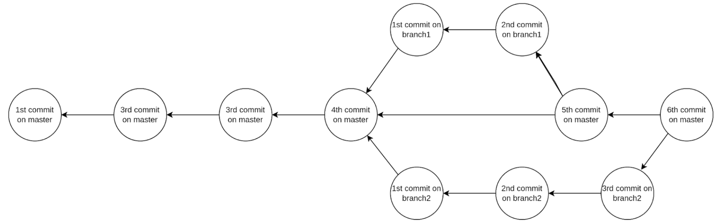

gitt pull --rebase 会拉取远程的 main 分支，并将本地提交重新应用在最新的远程代码上，避免产生多余的合并提交。
```
git pull --rebase origin main
```

使用add 命令让 Git 跟踪一个文件或目录，我们也可以通过取消缓存来让 Git 停止跟踪一个文件或目录

```shell
# git add test.txt 添加到暂存区域

# git  rm --cached  test.txt  撤销暂存到本地目录
# git rm --cached -r testdir/
```

当我们执行commit的时候，更改会被永久记录，提交树包含每个分支上所有提交的记录。

工作树是你处理文件和进行修改的地方。将文件或目录添加到暂存树意味着 Git 会跟踪你对该文件或目录的修改。提交树会永久保存你保存的工作。

```shell
#git log --oneline  查看commit的记录
#git diff    比较本地目录与暂存区的内容
```

创建和切换分支



```
#git branch feature/bobname   生成一个分支
#git checkout feature/bobname  切换分支
```

合并分支（主分支）

```
#git checkout main
#git merge feature/bobname
合并没有冲突后，可以删除分支
#git branch -d feature/bobname
当有冲突的时候，如下
<<<<<<< HEAD
This is change 1.
Bob
Bob's branch. Commit 1. Change 2.
========
This is Alice's conflict.
Alice
Alice's branch. Commit 1. Change 2.
>>>>>>> feature/bobname
然后我们选择想要的内容，最近执行commit
#git commit -am "修复了 test.txt 中的合并冲突"
```

